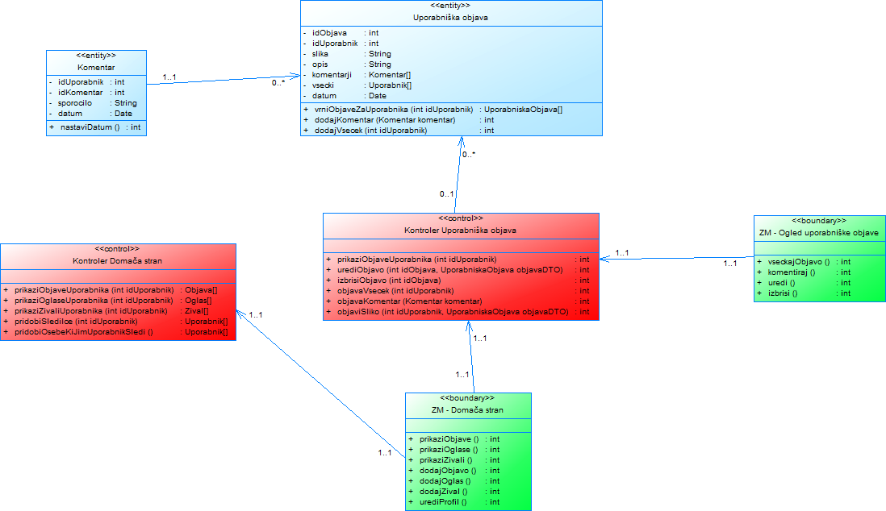
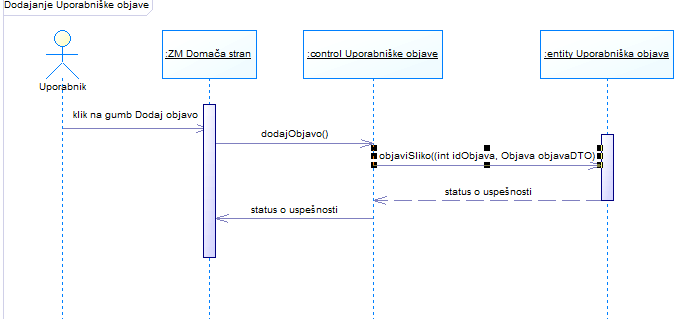
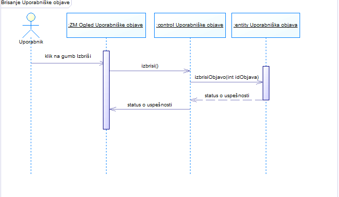
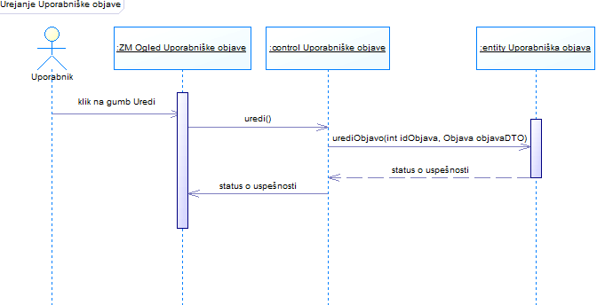
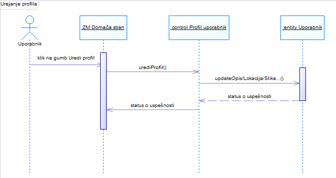

# Načrt sistema

|                             |                                                         |
| :-------------------------- | :------------------------------------------------------ |
| **Naziv projekta**          | Pet Buddy                               |
| **Člani projektne skupine** | Dizdarević Tim, Kukovičič Matevž, Grubar Jores, Jurkas Živa in Černe Žan |
| **Kraj in datum**           | Ljubljana, April 2021                                   |

## Povzetek

Dokument načrt rešitve je razdeljen v 3 razdelke. 

Načrt arhitekture predstavlja splošen pregled nad arhitekturo sistema, ki opisuje sistem kot organizirani sklop sodelujočih komponent sistema Pet Buddy. Predstavljen je s kratkim opisom načrta arhitekture in z razvojnim in logičnim pogledom na sistem Pet Buddy. 

Načrt strukture je predstavljen z razrednim diagramom sistema. Za boljšo preglednost so poleg globalnega razrednega diagrama podani še razredni diagrami za posamezne interakcije ter opisi posameznih razredov.

Načrt obnašanja, ki se nahaja v zadnjem razdelku, je prikazan z diagrami zaporedja interakcij. Za vsak primer uporabe je prikazan diagram zaporedja s prikazanimi tokovi dogodkov (osnovni, alternativni, izjemni).

## 1. Načrt arhitekture

V tem razdelku sta prikazana razvojni in logični pogled ter kratek opis arhitekture našega sistema Pet Buddy.

Pri načrtovanju arhitekture smo se odločili, da bomo uporabili ogrodje Angular in arhitekturni vzorec MVC, nad katerim je ogrodje zgrajeno. Vzorec predstavlja abstrakten načrt, kako organizirati programsko kodo, da bo kompleksnost lažje obvladljiva. Vzorec podaja način za organizacijo programske kode v manjše in izolirane dele.

V našem primeru torej Model, View in Controller. Model bo zadolžen za delo s podatki in podatkovnima bazama in ostalo poslovno logiko. View je zadolžen za prikaz podatkov uporabnikom, Controller je zadolžen za sprejem uporabnikovih ukazov in posredovanje med prvima dvema moduloma. Pri načrtovanju smo upoštevali tudi dobre prakse v obliki načrtovalskih vzorcev, ki bodo izboljšali organizacijo programske kode naše rešitve, jo naredilo enostavnejšo za upravljanje in razumevanje. Tako bomo med drugim uporabljali načrtovalski vzorec Singleton za logiranje, ter vzorec Factory Method pri kreiranju objektov.

* Razvojni pogled:

* Logični pogled:

## 2. Načrt strukture

V tem razdelku je z razrednimi diagrami in podrobnimi opisi posameznih razredov predstavljena podrobnejša struktura sistema Pet Buddy.

### 2.1 Razredni diagram

### 2.2 Opis razredov

#### Razredni diagram za registracijo 

----

#### Razredni diagram za prijavo 

----

#### Controller AvtentikacijaUporabnika 

Ta razred se uporablja pri registraciji, prijavi in splošni avtentikaciji. 

##### Atributi

Ta razred ne vsebuje atributov.

##### Nesamoumevne metode

* metoda: izvedi_registracijo
    * imena in tipi parametrov
        * uporabnikov_email: String
        * geslo1: String
        * geslo2: String
        * uporabnisko_ime: String
    * tip rezultata: void
    * pomen: posreduje ukaze za registracijo in vrne statusno kodo glede na uspeh postopka
    
* metoda: izvedi_prijavo
    * imena in tipi parametrov
        * uporabnikov_email: String
        * geslo: String
    * tip rezultata:void
    * pomen: posreduje ukaze za prijavo in vrne statusno kodo glede na uspeh postopka.
    
* metoda: avtenticiraj_sejo
    * imena in tipi parametrov
        * uporabnikov_email: String
        * status_uporabnika: String
    * tip rezultata: void
    * pomen: posreduje ukaze za avtentikacijo seje in vrne statusno kodo glede na uspeh postopka.
 
 * metoda: izvedi_potrditveni_email
    * imena in tipi parametrov
        * uporabnikov_email: String
    * tip rezultata: void
    * pomen: posreduje ukaze za pošiljanje potrditvenega emaila in vrne statusno kodo glede na uspeh postopka.

 * metoda: vrniStatus()
    * tip rezultata: void
    * pomen: vrne status krmilnika.
    
----

#### ZM_Registracija 

Ta razred se uporablja pri registraciji.

##### Atributi

Ta razred ne vsebuje atributov.

##### Nesamoumevne metode

* metoda: registriraj_se
    * metoda ne sprejme parametrov
    * tip rezultata: void
    * pomen: posreduje vnešene podatke, da se lahko izvede postopek registracije.
    
* metoda: prikazi_obvestilo_o_napaki
    * imena in tipi parametrov
        * napaka: String
    * tip rezultata: void
    * pomen: prikaže ustrezno obvestilo o napaki pri registraciji.
   
----

#### ZM_Prijava

Ta razred se uporablja pri prijavi v sistem.

##### Atributi

Ta razred ne vsebuje atributov.

##### Nesamoumevne metode

* metoda: prijavi_se
    * metoda ne sprejme parametrov
    * tip rezultata: void
    * pomen: posreduje vnešene podatke, da se lahko izvede postopek prijave.
    
* metoda: prikazi_obvestilo_o_napaki
    * imena in tipi parametrov
        * napaka: String
    * tip rezultata: void
    * pomen: prikaže ustrezno obvestilo o napaki pri prijavi.
  
----

#### SV_SistemEposta

Ta razred se uporablja pri pošiljanju potrditvenega emaila zunanjemu sistemu E-posta.

##### Atributi

Ta razred ne vsebuje atributov.

##### Nesamoumevne metode
    
* metoda: poslji_potrditveni_email
    * imena in tipi parametrov
        * uporabnikov_email: String
        * code: String
    * tip rezultata: void
    * pomen: pošlje potrditveni email na uporabnikov email.
  
----

#### Uporabnik

Ta razred se uporablja pri vseh aktivnostih, kjer je na kakršenkoli način potrebno dostopati do podatkov uporabnika in jih spreminjati

#### Atributi

* uporabnikov_email: String
* hashed_geslo: String
* tip_uporabnika: int
* status_uporabnika: int
* id_uporabnika: int
* uporabnisko_ime: String 

#### Nesamoumevne metode
    
* metoda: preveri_veljavnost_emaila
    * imena in tipi parametrov
        * uporabnikov_email: String
    * tip rezultata: void
    * pomen: preverimo, ali je email naslov veljaven in ali je že v uporabi.

* metoda: preveri_veljavnost_gesla
    * imena in tipi parametrov
        * geslo1: String
        * geslo2: String
    * tip rezultata: void
    * pomen: preverimo, ali se gesli ujemata in ali želeno geslo ustreza zahtevanim pogojem.
    
* metoda: preveri_veljavnost_geslo
    * imena in tipi parametrov
        * uporabnikov_email: String
        * hashed_geslo: String
    * tip rezultata: void
    * pomen: preverimo, ali je geslo pravilno glede na podani email naslov. Na strežniku se geslo pošlje skozi hash funkcijo in nato primerja z geslom v bazi.

* metoda: preveri_veljavnost_uporabniskoIme
    * imena in tipi parametrov
        * uporabnisko_ime: String
    * tip rezultata: void
    * pomen: preverimo, ali je uoorabnisko ime veljavno in ali je že v uporabi.

* metoda: preveri_tipUporabnika
    * imena in tipi parametrov
         * uporabnikov_email: String
    * tip rezultata: void
    * pomen: preverimo, kateri tip uporabnika je trenutni uporabnik.

* metoda: dodaj_novega_uporabnika
    * imena in tipi parametrov
        * uporabnikov_email: String
        * hashed_geslo: String
    * tip rezultata: void
    * pomen: podani email naslov in hashed geslo shranimo v podatkovno bazo za kasnejšo prijavo.

* metoda: preveri_veljavnost_registracije
    * imena in tipi parametrov
        * code: String
    * tip rezultata: void
    * pomen: pri postopku registracije preverimo, ali je potrditveni token (code) že potekel.

* metoda: dodaj_uporabnika_v_seznam_nepotrjenih
    * imena in tipi parametrov
        * uporabnikov_email: String
        * code: String
    * tip rezultata: void
    * pomen: pri postopku registracije dodamo v bazo vnos z uporabnikovim email naslovom in unikatnim potrditvenim codom, ki je veljaven 2 dni.

* metoda: odstrani_uporabnika_iz_seznama_nepotrjenih
    * imena in tipi parametrov
        * uporabnikov_email: String
    * tip rezultata: void
    * pomen: pri postopku registracije iz baze odstranimo vnos o uporabnikovem email naslovu in s tem zaključim postopek registracije.

* metoda: shrani_dostopni_status
    * imena in tipi parametrov
        * uporabnikov_email: String
        * cas_dostopa: Date
    * tip rezultata: void
    * pomen: Po prijavi shranimo status, ki bo do konca seje služil avtentikaciji uporabnika s podanim email naslovom.

* metoda: dostopni_cookie
    * metoda ne sprejme parametrov
    * tip rezultata: Piskotek
    * pomen: Uporabniku posljemo generiran dostopni piškotek, ki ga bo v nadaljevanju seje pošiljal strežniku in od strežnika prejemal za namene avtentikacije.

* metoda: preveri_dostopni_status
    * imena in tipi parametrov
        * uporabnikov_email: String
        * dostopni_status: String
    * tip rezultata: void
    * pomen: Preverimo, ali je dostopni status za uporabnika s podanim email naslovom še vedno veljaven oziroma ali je uporabnikova seja že potekla.

* metoda: vrniSeznamUporabnikov
    * tip rezultata: Uporabnik []
    * pomen: vrne seznam uporabnikov.

----

#### Controller Meta

Ta razred se uporablja pri posredovanju sporočil, argumentov, statusov drugim kontrolerjem.
##### Atributi

Ta razred ne vsebuje atributov.

##### Nesamoumevne metode

Metode so samoumevne.

##### Razredni diagram za Controller Meta

----

### Funkcionalnosti oglasa

Funkcionalnosti oglasa na globalnem diagramu predstavlja razred oglas. Znotraj razreda oglas so vključene tudi funkcionalnosti filtriranja. 

**Razredni diagram za funkcionalnost oglasa**

#### Control oglas

- omogoča pridobivanje podatkov o oglasih
- omogoča posredovanje podatkov o oglasih
- omogoča pridobivanje podatkov o filtrih
- omogoča posredovanje podatkov o filtrih

##### Atributi

- idOglas : int - enolični identifikator oglasa
- naslov : string - naslov oglasa
- datum : date - čas objave oglasa
- opis : string - opis oglasa
- regija : string - statistična regija oglaševalca
- zival : string - vrsta živali
- foto : string - fotografij živali
- skrbnik : boolean - določitev oglasa kot iskalec ali skrbnik živali

##### Nesamoumevne metode

- **getOglasiSkrbnikov()**

Funkcionalnost: pridobivanje podatkov o vseh oglasih skrbnikov
Parametri: /
Rezultat: pridobitev podatkov o vseh oglasih skrbnikov iz entitete oglas

- **getOglasiIskalcev()**

Funkcionalnost: pridobivanje podatkov o vseh oglasih iskalcev
Parametri: /
Rezultat: pridobitev podatkov o vseh oglasih iskalcev iz entitete oglas

- **getOglas(idOglas)**

Funkcionalnost: pridobivanje podatkov o posameznemu oglasu.

Parametri: 
- idOglas : int - enolični identifikator oglasa

Rezultat: pridobitev vseh podatkov o posameznem oglasu iz entitete oglas

- **setOglas(idOglas, naslov, datum, opis, regija, zival, foto, skrbnik)**

Funkcionalnost: pošiljanje podatkov o posameznem oglasu
Parametri: 
- idOglas : int - enolični identifikator oglasa
- naslov : string - naslov oglasa
- datum : date - čas objave oglasa
- opis : string - opis oglasa
- regija : string - statistična regija oglaševalca
- zival : string - vrsta živali
- foto : string - fotografij živali
- skrbnik : boolean - določitev oglasa kot iskalec ali skrbnik živali

Rezultat: podatki o posameznem oglasu poslani zaslonski maski ZM_obrazecOglas
Pomen: metoda je uporabljena tudi pri seznamskem prikazovanju oglasov ob klicu metod getOglasiSkrbnikov() in getOglasiIskalcev()

- **filterOglas(regija, zival)**

Funkcionalnost: pošiljanje podatkov filtriranja

#### Entity oglas

- podatkovna zbirka, ki hrani podatke o oglasu

##### Atributi

- idOglas : int - enolični identifikator oglasa
- naslov : string - naslov oglasa
- datum : date - čas objave oglasa
- opis : string - opis oglasa
- regija : string - statistična regija oglaševalca
- zival : string - vrsta živali
- foto : string - fotografij živali
- skrbnik : boolean - določitev oglasa kot iskalec ali skrbnik živali

##### Nesamoumevne metode

- **sendOglasiSkrbnikov()**

Funkcionalnost: pošiljanje podatkov vseh oglasov skrbnikov
Parametri: /
Rezultat: podatki o vseh oglasih skrbnikov poslani control-erju oglas

- **sendOglasiIskalcev()**

Funkcionalnost: pošiljanje podatkov vseh oglasov iskalcev
Parametri: /
Rezultat: podatki o vseh oglasih iskalcev poslani control-erju oglas

- **sendOglas(idOglas, naslov, datum, opis, regija, zival, foto, skrbnik)**

Funkcionalnost: pošiljanje podatkov enega oglasa
Rezultat: podatki o posameznem oglasu poslani control-erju oglas

- **filterOglas(regija, zival)**

Funkcionalnost: pošiljanje podatkov filtriranja

#### Boundary ZM_oglasi

- zaslonska maska, ki prikazuje vse oglase

##### Atributi

Atributi so enaki kot za entity oglas, saj se uporabljajo enaki podatki.

##### Nesamoumevne metode

- **getOglasiSkbrnikov()**

Funkcionalnost: pridobivanje podatkov za prikaz vseh oglasov skrbnikov
Rezultat: prikaz vseh oglasov skrbnikov

- **getOglasiIskalcev()**

Funkcionalnost: pridobivanje podaktkov za prikaz vseh oglasov iskalcev
Rezultat: prikaz vseh oglasov iskalcev

- **filterOglas(regija, zival)**

Funkcionalnost: pošiljanje podatkov filtriranja

#### boundary ZM_obrazecOglas

- zaslonska maska, ki prikazuje posamičen oglas

#### Atributi

Atributi so enaki kot za entity oglas, saj se uporabljajo enaki podatki.

#### Nesamoumevne metode

- **getOglas(idOglas, naslov, datum, opis, regija, zival, foto, skrbnik)**

Funkcionalnost: pridobivanje podatkov za prikaz posameznega oglasa
Rezultat: prikaz posameznega oglasa

----

### Funkcionalnosti upravljanja sporočil

Funkcionalnosti uporavljanja sporočil na globalnem diagramu predstavlja razred uporavljanjeSporocil. Znotraj razreda uporavljanjeSporocil so še funkcionalnosti kontaktiranja.

**Razredni diagram za funkcionalnost upravljanja sporočil**

#### Control upravljanjeSporocil

- omogoča pridobivanje in pošiljanje podatkov o sporočilih med uporabniki

##### Atributi

- idUporabnik : int - enolična identifikacija pošiljatelja
- idPrejemnik : int - enolična identifikacija prejemnika
- naslov : string - naslov sporočila
- sporocilo : string - besedilo, vsebina sporočila
- sprejem : boolean - oznaka zavrnjeno ali sprejeto sporočilo

##### Nesamoumevne metode

- **getSporocila()**

Funkcionalnost: pridobivanje podatkov o vseh sporočilih uporabnika
Rezultat: pridobljeni podatki vseh sporočil uporabnika

- **sendSporocilo(idUporabnik, idPrejemnik, naslov, sporocilo)**

Funkcionalnost: prenos podatkov iz ZM_vsaSporocila naprej v poslovni razred sporocilo
Rezultat: prenos sporočila

- **sendSprejem(idUporabnik, idPrejemnik, sprejem)**

Funkcionalnost: pošiljanje podatka o sprejemu
Rezultat: podatek o sprejetju posredovan poslovnemu razredu sporocilo

#### Boundary ZM_vsaSporocila

- omogoča pridobivanje podatkov in prikaz vseh sporočil uporabnika
- omogoča pošiljanje sporočil drugim uporabnikom
- omogoča zavračanje/sprejemanje prošenj drugih uporabnikov

##### Atributi

- idUporabnik : int - enolična identifikacija pošiljatelja
- idPrejemnik : int - enolična identifikacija prejemnika
- naslov : string - naslov sporočila
- sporocilo : string - besedilo, vsebina sporočila
- sprejem : boolean - oznaka zavrnjeno ali sprejeto sporočilo

##### Nesamoumevne metode

- **showSporocila()**

Funkcionalnost: pridobivanje podatkov in prikaz vseh sporočil uporabnika
Rezultat: pridobljeni podatki vseh sporočil prikazani uporabniku preko zaslonske maske

- **sendSporocilo(idUporabnik, idPrejemnik, naslov, sporocilo)**

Funkcionalnost: vpisani podatki v zaslonsko masko se posredujejo control upravljanjeSporocil
Rezultat: sporočilo posredovano control-erju za upravljanjeSporocil

- **sendSprejem(idUporabnik, idPrejemnik, sprejem)**

Funkcionalnost: pošiljanje podatka o sprejemu sporočila
Rezultat: podatek o sprejetju posredovan control-erju upravljanjeSporocil

#### Entity sporocilo

- shranjevanje podatkov sporočil
- shranjevanje podatkov o sprejemu ali zavrnitvi sporočil
- pošiljanje podatkov sporočil

##### Atributi

- idUporabnik : int - enolična identifikacija pošiljatelja
- idPrejemnik : int - enolična identifikacija prejemnika
- naslov : string - naslov sporočila
- sporocilo : string - besedilo, vsebina sporočila
- sprejem : boolean - oznaka zavrnjeno ali sprejeto sporočilo

##### Nesamoumevne metode

- **sendSporocila()**

Funkcionalnost: pošiljanje podatkov o vseh sporočilih uporabnika
Rezultat: poslani podatki vseh sporočil uporabnika

- **saveSporocilo(idUporabnik, idPrejemnik, naslov, sporocilo)**

Funkcionalnost: shramba podatkov poslanega sporočila
Rezultat: podatki o sporočilu shranjeni

- **changeSprejem(idUporabnik, idPrejemnik, sprejem)**

Funkcionalnost: shranjevanje podatka o sprejemu ali zavritvi sporočila
Rezultat: shranjen podatek o sprjemu ali zavrnitvi sporočila

----

#### Controller Profil Uporabnik

- Prikaz in urejanje podatkov uporabnika; imena, profilne fotografije, opisa, lokacije, povprečne ocene in odzivov, Followers in Following ter št. Tokenov
- Za administratorja tudi opcija deaktivacije in aktivacije uporabnika

##### Atributi
Razred nima atributov

##### Nesamoumevne metode

- PrikazOdzivov() ; metoda se kliče, ko uporabnik klikne gumb *Odzivi*, da se mu prikaže obrazec za oddajo odziva ter vsi pretekli odzivi
- Activate uporabnik(int Uporabnik Id) ; s pomočjo metode lahko administrator aktivira deaktiviranega uporabnika
- Deactivate uporabnik(int Uporabnik Id) ; s pomočjo metode lahko administrator deaktivira uporabnika

----

#### Geolokacija

- klic API-ja za pridobitev in prikaz lokacije uporabnika

##### Atributi
- lng : long ; zemljepisna dolžina
- lat : long ; zemljepisna širina

##### Nesamoumevne metode

Metode so samoumevne.

----

#### Uporabniške objave uporabnika

- Prikaz uporabniških objav uporabnika na njegovem profilu

##### Atributi
Razred nima atributov.

##### Nesamoumevne metode

- PrikažiObjavo(int UporabniškaObjava id) ; klic metode se izvede, ko uporabnik klikne na uporabniško objavo, da se mu prikaže objava s podrobnimi podatki ter z opcijo urejanja

----

#### Oglasi uporabnika

- Prikaz oglasov uporabnika na njegovem profilu

##### Atributi
Razred nima atributov.

##### Nesamoumevne metode
- pošljiZanimanje(int Oglas_id, int Pošiljatelj_id, int Prejemnik_id String Besedilo) ; metodo kličemo, ko pritisnemo na gumb "zanima me" na oglasu in s pomočjo nje obvestimo lastnika oglasa, da nas oglas zanima.

----

#### Controller Zival

- Skrbi za pridobivanje ter manipuliranje razreda zival iz baze, pridobivanje vseh zivali uporabnika in pridobivanje podrobnosti posamezne zivali

##### Nesamoumevne metode

- CreateZival(id uporabnika, Zival) ; metoda se kliče, ko želi uporabnik dodati (kreirati) novo žival na svojem profilu. Metodi se poda id uporabnika, ki želi kreirati žival, in pa razred Zival, ki vsebuje vse informacije o pravkar kreirani živali. Razred Zival se metodi poda brez atributa id, saj mu ga ob kreiranju v bazi pripiše metoda sama
- EditZival(id uporabnika, Zival) ; metoda se kliče, ko želi uporabnik spremeniti informacije o živali na svojem profilu, ali pa ko želi živali tujega uporabnika dodati svojo sliko s to živaljo. Metoda identificira za katero žival gre glede na atribut id v razredu Zival.

#### Boundary ZM Obrazec zivali 
- omogoča prikaz vnosnih polj, ki so namenjena dodajanju (kreiranju) nove živali za uporabnika ali pa spreminjanje podatkov že obstoječe živali

##### Nesamoumevne metode

Metode so samoumevne.

#### Boundary ZM ogled zivali
- omogoča podroben prikaz zivali nekega uporabnika

##### Nesamoumevne metode

Metode so samoumevne.

#### Boundary ZM Zival uporabnika
- omogoča prikaz vseh zivali, objavljenih na profilu določenega uporabnika

##### Nesamoumevne metode

Metode so samoumevne.

#### Entity Zival

- shranjevanje podatkov o živali

##### Atributi

- id : int - enolična identifikacija živali
- idLastnik : String - enolična identifikacija uporabnika, ki je lastnik živali (tisti, ki je kreiral to instanco razreda Zival)
- SlikeZival : SlikaZival[] - vse objavljene slike te živali
- opis : string - opis živali, ki ga ob kreiranju napiše lastnik
- starost : int - starost zivali
- spol : int - spol zivali, predstavljen s stevilko 

##### Nesamoumevne metode

- GetAllSlika() : SlikaZival[]; metoda, ki vrne vse slike živali
- GetMainSlika() : SlikaZival; metoda, ki vrne glavno sliko za prikaz živali

#### Entity SlikaZival

- shranjevanje podatkov o sliki živali

##### Atributi

- id : int - enolična identifikacija slikeživali
- idZival : int - enolična identifikacija zivali, ki je lastnik živali (tisti, ki je kreiral to instanco razreda Zival)
- idLastnika : int- vse objavljene slike te živali

##### Nesamoumevne metode

Metode so samoumevne.

----

#### ZM Prikaz odzivov

- Prikaz odzivov ter obrazca za oddajo odziva

##### Atributi

**TO DO**

##### Nesamoumevne metode

Metode so samoumevne.

----

#### Odziv

- Entitetni razred, ki hrani podatke za odziv

##### Atributi

- Odziv id 
- Besedilo
- Rating : int ; število zvezdic - od 1 do 5
- Pošiljatelj id : int ; id uporabnika, ki je pustil odziv
- Prejemnik id : int ; id uporabnika, kateremu je odziv namenjen

##### Nesamoumevne metode

Metode so samoumevne.

----

#### Controller Odzivi

- Razred za upravljanje z odzivi

##### Atributi

- Odziv id 
- Besedilo
- Rating : int ; število zvezdic - od 1 do 5
- Pošiljatelj id : int ; id uporabnika, ki je pustil odziv
- Prejemnik id : int ; id uporabnika, kateremu je odziv namenjen

##### Nesamoumevne metode

Metode so samoumevne.

----

### Funkcionalnost objava

Funkcionalnosti objave na globalnem diagramu predstavlja razred objava.

**Razredni diagram za objavo**

#### Komentar

- Entitetni razred, ki hrani podatke za komentar

##### Atributi

- idUporabnik : int
- idKomentar : int
- sporocilo : string ; samo sporočilo, ki ga uporabnik napiše kot komentar
- datum : Date ; avtogeneriran, ko uporabnik objavi komentar

##### Nesamoumevne metode

- nastaviDatum(): void; komentarju doda datum na katerega je bil komentar generiran

#### Entiteta Uporabniška objava

- Entitetni razred, ki hrani podatke za uporabniško objavo

##### Atributi

- idUporabnik : int
- idObjava : int
- slika : string : slika objave, kodirana v base64 formatu
- opis : string : opis objave
- komentarji : Komentar[] : seznam komentarjev, ki pripadajo objavi
- vsecki : Uporabnik[] : seznam uporabnikov, ki so všečkali objavo
- datum : Date : avtomatsko generiran datum, ob objavi objave

##### Nesamoumevne metode

- vrniObjaveZaUporabnika(int idUporabnik): UporabniskaObjava[]; vrne vse uporabniške objave za določenega uporabnika
- dodajKomentar(Komentar komentar): int; doda uporabniški komentar objavi
- dodajVsecek(int idUporabnik) : int; doda uporabnika na seznam uporabnikov, ki so všečkali objavo

#### Kontroler Uporabniška objava

- Skrbi za pridobivanje in manipuliranje uporabniških objav 

##### Atributi

Ni atributov.

##### Nesamoumevne metode

- prikaziObjaveUporabnika(int idUporabnik): int
- urediObjavo(int idObjava): int; omogočeno samo avtorju objave
- izbrisiObjavo(int idObjava): int; omogočeno samo avtorju objave
- objavaVsecek(int idObjava): int; omogoča uporabniku, da se doda na seznam uporabnikov, ki so všečkali objavo
- objavaKomentar(int idObjava): int; omogoča uporabniku, da komentira objavo
- objaviSliko(int idObjava): int; omogoča uporabniku, da z žetonom kreira novo objavo

#### Kontroler Domača stran

- Skrbi za prikaz in manipulacijo domače strani uporabnikov

##### Atributi

Ni atributov.

##### Nesamoumevne metode

- prikaziObjaveUporabnika(int idUporabnik): Objava[]
- prikaziOglaseUporabnika(int idUporabnik): Oglas[]
- prikaziZivaliUporabnika(int idUporabnik): Zival[]
- pridobiSledilce(int idUporabnik): Uporabnik[]; pridobi uporabnike, ki sledijo uporabniku z id-jem idUporabnik
- pridobiOsebeKiJimUporabnikSledi(int idUporabnik): Uporabnik[]; pridobi uporabnike, katerim sledi uporabnik z id-jem idUporabnik

----
#### ZM - Domača stran

- Skrbi za prikaz in glede na status lastništva profila tudi moderacijo uporabniškega profila.

##### Atributi

Ni atributov.

##### Nesamoumevne metode

- prikaziObjave(): int; prikaže vse objave uporabnika ob kliku na zavihek Objave na profilu uporabnika
- prikaziOglase(): int;prikaže vse oglase uporabnika ob kliku na zavihek Objave na profilu uporabnika
- prikaziZivali(): int;prikaže vse živali uporabnika ob kliku na zavihek Objave na profilu uporabnika
- dodajObjavo(): int; lastniku profila, glede na razpoložljive žetone, omogoča dodajanje nove objave danemu profilu
- dodajOglas(): int, lastniku profila omogoča dodajanje novega oglasa danemu profilu
- dodajZival(): int, lastniku profila omogoča dodanjanje nove živali danemu profilu

----

#### ZM - Ogled uporabniške objave

- Skrbi za prikaz uporabniške objave.

##### Atributi

Ni atributov.

##### Nesamoumevne metode

- vseckajObjavo(): int; omogoča uporabniku, da se doda na seznam uporabnikov, katerim je objava všeč
- komentiraj(): int; omogoča uporabniku, da dano objavo komentira
- uredi(): int; lastniku objave omogoča urejanje le-te
- izbirsi(): int; lastniku objave omogoča izbris le-te

----

## 3. Načrt obnašanja

V tem razdelku je z diagrami zaporedja predstavljeno podrobno obnašanje sistema Pet Buddy.

**PU: Registracija**
* Osnovni tok:

* Alternativni tok - Registracijo izvede administrator:

----

**PU: Prijava**
* Osnovni tok:

Opomba: Uporabnik označuje registriranega uporabnika, administratorja ali moderatorja.

----

**PU: Ogled uporabniških objav**
* Osnovni tok:

Opomba: Uporabnik označuje registriranega uporabnika ali moderatorja.

----

**PU: Všečkanje uporabniških objav**
* Osnovni tok:

----

**PU: Komentiranje uporabniških objav**
* Osnovni in alternativni tok:

----
**PU: Prikaz uporabnikov, ki jim sledimo**
* Osnovni in izjemni tok:

----
**PU: Prikaz uporabnikov, ki nam sledijo**
* Osnovni in izjemni tok:

----

**PU: Sledenje uporabniku**
* Osnovni in izjemni tok:

----

**PU: Iskanje po uporabnikih**
* Osnovni tok:

Opomba: Uporabnik označuje registriranega uporabnika ali moderatorja.

----

**PU: Profil - ogled uporabniških objav**

----

**PU: Profil - ogled oglasov uporabnika**

----

**PU: Profil - ogled živali uporabnika**

----

**PU: Objava oglasa**
* Osnovni tok:

* Izjemni tok1:

-----

**PU: Oddaja odziva**

----

**PU: Prikaz lokacije**

----

**PU: Odjava**

----

**PU: Ogled oglasov**

----

**PU: Filtriranje oglasov**

----

**PU: Kontaktiranje** 

----

**PU: Upravljanje prošenj**

----

**PU: Deaktivacija uporabniškega računa**

----

**PU: Dodajanje Uporabniške objave**

----

**PU: Brisanje Uporabniške objave**

----

**PU: Urejanje Uporabniške objave**

----

**PU: Urejanje Uporabniškega profila**

----
